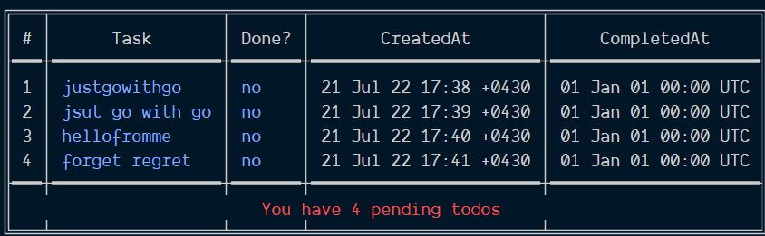

## This is a todo cli that track your todos and save it in json file

It has these commads:

```
    1) -add "Your todo task"
    2) -complete={todo index}
    3) -delete={todo index}
    5) -list

```


#### I hope you like it.
